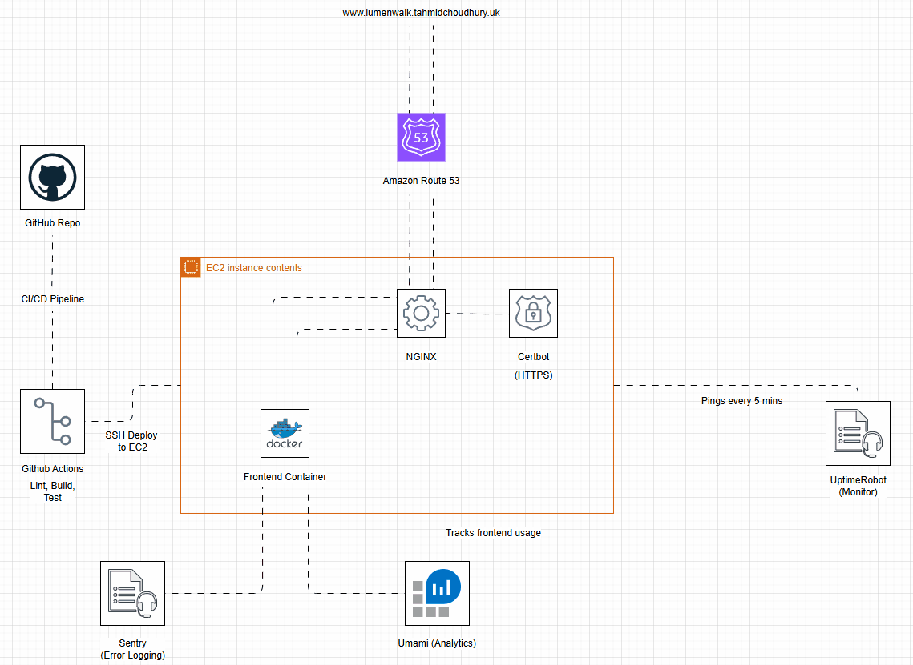

# 🌙 LumenWalk

LumenWalk is a smart walking route planner designed to help users choose the **safest** path between two locations — especially for night-time walks.

## 📐 LumenWalk Architecture

This diagram shows how LumenWalk is deployed on AWS EC2 using Docker and NGINX. GitHub Actions handles CI/CD, and external services like Umami and Sentry provide analytics and error tracking. HTTPS is secured using Certbot, and uptime is monitored via UptimeRobot.

## 🛠 What It Does

- Lets you input a **start** and **destination**
- Provides **3 route options** via Mapbox Directions API
- Uses **OpenAI** to summarize each route’s:
  - Estimated time
  - Crime exposure (via UK Police API)
  - Lighting and environment quality (via OpenStreetMap)

## 🎯 Core Features

- 🔍 Route input with AI safety summaries
- 🔗 Shareable route links
- 🗳 Companion feedback (e.g. “Looks safe”)
- ✍️ _(Optional)_ Draw-your-own route for custom safety planning

## 💡 Tech Stack

- Next.js + TypeScript
- Mapbox GL JS + Directions API
- OpenAI GPT-4
- UK Police API
- Overpass (OSM) for lighting
- (Optional) Weaviate for storing community feedback

---

> “LumenWalk helps you walk smarter, not just faster.”
